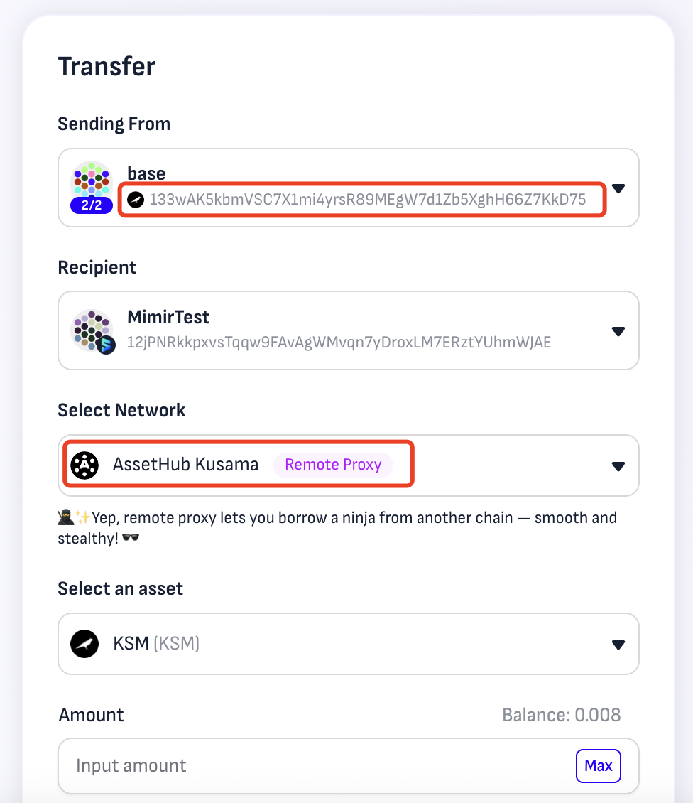

# 👁️ Call Data Verification

Polkadot & parachains use Polkadot-SDK, ensuring all transactions have on-chain metadata—no unreadable 0xbytes. If you don’t fully trust calldata during execution, Mimir also provides additional verification tools to help you ensure transaction security.

<figure><figcaption></figcaption></figure>

Click **View Detail** next to Call Data to open a detailed view displaying the full Call Data JSON file.

You can compare all parameters, method names, and other details to ensure they match the expected transaction. If anything is incorrect or unexpected, **DO NOT** approve the transaction.
